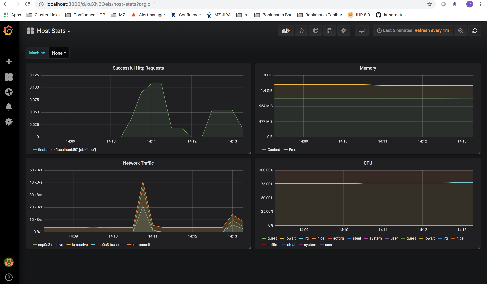

# devops-project
Create a Vagrantfile which provisions a VM

# Introduction
Hi, thanks for your interest in our Devops Engineering position. As part of the interview process, we'd like you to setup a simple web application and database.

# Steps
1. Fork this repo to your personal GitHub profile
2. Clone this repo to your computer
3. Modify the initial Vagrantfile to setup the web application.
4. Add any code/scripts needed to provision the server.
5. Add to the bottom of this README.md file details on how to run you project locally.
6. Make a pull request for us to review your code.

### Your project should
1. Use the specified Ubuntu 16.04 box as the starting point
2. Install the following components
    1. The latest MySQL
    2. The latest Apache2
    3. The latest PHP 7.X
3. Configure the following components
    1. Create a "Users" table in the database with the following columns
        1. "FirstName"
        2. "LastName"
        3. "Age"
        4. "CreatedAtTimestamp"
    2. The database username and password should be "testdb"
    3. Run the http/application server on port 80 on the guest
    4. Create a "phpinfo.php" page which shows the PHP details
4. Expose the following to the host
    1. Your application server should be reachable on http://localhost:8001
    2. Your phpinfo.php page should be at http://localhost:8001/phpinfo.php
    3. Your database server on port 3001

### Bonus points
1. Create a webapp/single page that allows the following
    1. Include forms to allow user input of "FirstName" "LastName" and "Age" and to persist it to the database
    2. Include a way to view the full "Users" table
2. NOTE: This can be done in any language.

### You should
1. Use any form of provisioning you'd like (Ansible, Chef, Puppet, Salt, sh/csh/bash/ksh scripting)
2. Allow SSH access to the VM while it is running

### It's not reqiured, but your project can
1. Use open source libraries
2. Use multiple provisioners or bootstrap your own
3. Use multiple VMs to run the different components

### We will evaluate the project based on the following criteria
1. Meeting the project requirements listed above
2. Code quality
3. Bonus points section completion

Feel free to reach out to us for clarifications.

Thanks and good luck!


# How to run the Webapp Locally
## Requirements
Install following in your Local machine

VirtualBox http://www.virtualbox.org<br/>
Vagrant http://www.vagrantup.com<br/>
Git https://git-scm.com<br/>
## Setup
```git clone https://github.com/praveengraton/devops-project.git```<br/>
To install and run the webapp ```cd devops-project``` and  type ```make``` or ```vagrant up```
### App:
Access Webapp on: http://localhost:8001<br/>
Access Phpinfo page on: http://localhost:8001/phpinfo.php<br/>

WebApp will allow you to<br/>
    - Add a New User<br/>
    - View all User data<br/>
vagrant ssh<br/>
MySQL DB can be accessed over the port 3001 on localhost<br/>
### Monitoring the application
The webapp's successful and un-successful requests are collected and stored to Redis and the Host metrics are collected using Node-exporter <br/>
Used Prometheus to scrape metrics from both the endpoits(Redis and Node-exporter)<br/>
Created metric dashboards in grafana using prometheus as a datasource.<br/>
### Grafana:
Access Grafana Host Dashboard on: http://localhost:3000/<br/>
```Username: admin```<br/>
```Password: admin``` (Note: Please skip the pasword reset option)<br/>

Once you login navigate to Home->Host Stats(dashboard) which have app metrics and Host metrics

### Prometheus:
Aceess Prometheus service on : http://localhost:9090/ --> You can see all the metrics collected from the redis and nodeexporter endpoints